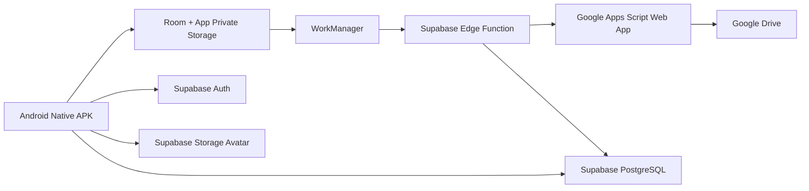
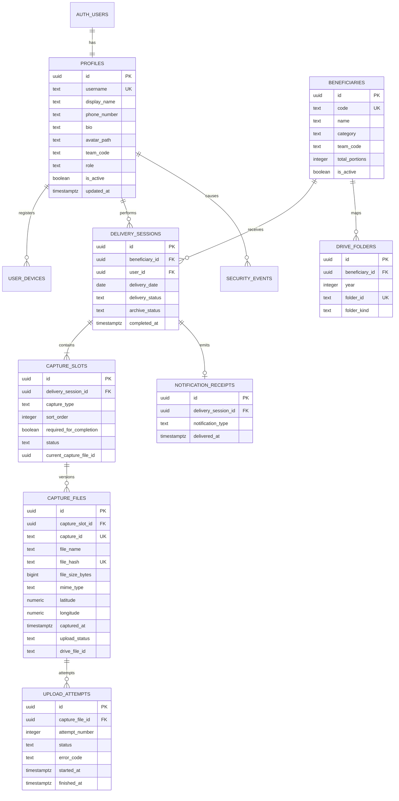

# GEMINI.MD — SIGAP GIZI

> **Status:** BASELINE TERKUNCI  
> **Project:** SIGAP GIZI — SPPG Bandung Padasuka  
> **Dokumen:** Instruksi Utama AI Coding Agent, PRD, Arsitektur, ERD, Security Baseline, dan Engineering Governance  
> **Platform:** Android Native  
> **Biaya operasional target:** Rp0 per bulan  
> **Tanggal baseline:** 31 Juli 2026  
> **Bahasa dokumentasi dan antarmuka:** Bahasa Indonesia baku

---

## 0. KEDUDUKAN DOKUMEN

`GEMINI.MD` adalah sumber instruksi tertinggi bagi Gemini atau AI coding agent yang bekerja pada repository SIGAP GIZI.

Prioritas instruksi:

1. Instruksi eksplisit pemilik project.
2. `GEMINI.MD`.
3. Architecture Decision Record atau ADR yang telah disetujui.
4. PRD dan dokumentasi teknis lain.
5. Konvensi framework resmi.
6. Preferensi agent.

Jika terdapat konflik, agent **wajib berhenti pada perubahan yang konflik**, menjelaskan dampaknya, dan tidak boleh diam-diam mengganti keputusan arsitektur.

Dokumen ini tidak boleh diperlakukan sebagai saran opsional. Semua kata **WAJIB**, **DILARANG**, **HARUS**, dan **TERKUNCI** bersifat normatif.

---

# BAGIAN I — MANDAT AI CODING AGENT

## 1. PERAN AGENT

Agent bertindak sebagai:

- Staff-level Android Engineer.
- Software Architect.
- Application Security Engineer.
- Database Engineer.
- QA Automation Engineer.
- Release Engineer.

Agent tidak bertindak sebagai pembuat prototipe cepat yang mengorbankan maintainability.

## 2. SASARAN UTAMA AGENT

Agent wajib menghasilkan sistem yang:

- Native Android sepenuhnya.
- Aman untuk penggunaan internal.
- Tetap berfungsi saat koneksi internet buruk.
- Tidak menyimpan foto di galeri pengguna.
- Mengirim dokumentasi ke folder Google Drive yang benar.
- Menjaga isolasi akses antara Team Distribusi 01 dan Team Distribusi 02.
- Memiliki biaya bulanan Rp0 selama masih berada dalam kuota layanan gratis.
- Mudah dirawat oleh satu engineer.
- Dapat diuji secara otomatis.
- Tidak memiliki file sumber berukuran berlebihan.

## 3. PROTOKOL KERJA AGENT

Sebelum menulis kode, agent wajib:

1. Membaca seluruh `GEMINI.MD`.
2. Mengidentifikasi domain dan layer yang akan diubah.
3. Memeriksa apakah sudah ada abstraksi yang sesuai.
4. Memastikan perubahan tidak membuat file melebihi 200 baris.
5. Menyusun atau memperbarui test terlebih dahulu untuk bug dan business rule kritis.
6. Memeriksa risiko keamanan dan data leakage.
7. Menjalankan quality gate setelah implementasi.

Agent tidak boleh:

- Membuat ulang arsitektur tanpa ADR.
- Memindahkan penyimpanan foto dari Google Drive ke Supabase Storage.
- Menambahkan panel admin.
- Menambahkan role baru tanpa persetujuan.
- Menanam credential sensitif ke APK.
- Menggunakan library alpha, beta, RC, snapshot, atau nightly pada production build.
- Menghasilkan kode placeholder yang disebut production-ready.

---

# BAGIAN II — KEPUTUSAN PROJECT YANG TERKUNCI

## 4. IDENTITAS PRODUK

| Item | Nilai |
|---|---|
| Nama produk | SIGAP GIZI |
| Kepanjangan | Sistem Informasi Geolokasi dan Arsip Penyaluran Gizi |
| Unit | SPPG Bandung Padasuka |
| Platform | Android Native |
| IDE | Android Studio |
| Output distribusi | Signed Release APK |
| Pengguna | 2 akun |
| Role | `TEAM_DISTRIBUSI` |
| Panel admin | Tidak ada |
| Total lokasi | 27 |
| Total porsi | 2.628 |
| Penyimpanan foto final | Google Drive |
| Database dan Auth | Supabase Free |
| Target biaya | Rp0 per bulan |

## 5. AKUN DAN TEAM

| Akun | Team | Lokasi | Total Porsi |
|---|---|---:|---:|
| Wawan | TEAM DISTRIBUSI 01 | 13 | 1.402 |
| Yudi | TEAM DISTRIBUSI 02 | 14 | 1.226 |

Aturan:

- Satu team hanya memiliki satu akun aplikasi.
- Wawan hanya memiliki akses ke Team Distribusi 01.
- Yudi hanya memiliki akses ke Team Distribusi 02.
- Zaki dan Wisnu bukan akun aplikasi.
- `team_code`, `role`, `user_id`, dan status akun tidak dapat diubah oleh user.
- Team tidak boleh ditentukan dari request body client sebagai sumber otoritatif.
- Team wajib diturunkan dari JWT dan profil server-side.

## 6. DOKUMENTASI PER LOKASI

Setiap sekolah dan Posyandu memiliki lima slot dokumentasi:

| Urutan | Kode | Label | Konteks |
|---:|---|---|---|
| 01 | `BEFORE_DELIVERY` | Sebelum Pengiriman | SPPG |
| 02 | `FOOD_ARRIVED` | Makanan Sampai | Lokasi penerima |
| 03 | `WITH_PIC` | Bersama PIC | Lokasi penerima |
| 04 | `TRAY_PICKUP` | Pengambilan Tray | Lokasi penerima |
| 05 | `TRAY_DROPOFF` | Penurunan Tray | SPPG |

Aturan status:

- `01`, `02`, dan `03` adalah syarat status pengiriman `COMPLETED`.
- `04` dan `05` adalah dokumentasi tray.
- `04` dan `05` tidak menghambat status pengiriman `COMPLETED`.
- Seluruh lima slot berhasil berarti arsip harian `ARCHIVE_COMPLETE`.
- Notifikasi sistem Android hanya muncul satu kali ketika status lokasi berubah menjadi `COMPLETED`.

## 7. KEPUTUSAN PENYIMPANAN FOTO

- Kamera wajib dibuka di dalam aplikasi dengan CameraX.
- Tidak tersedia pemilih foto dari galeri untuk dokumentasi operasional.
- Foto tidak boleh disimpan ke `MediaStore`, `DCIM`, `Pictures`, atau galeri publik.
- Foto disimpan sementara di app-private cache.
- Foto sementara diproses, diberi watermark, dikompres, dan dihitung SHA-256.
- Foto dihapus setelah Google Drive File ID diterima dan metadata sukses disimpan.
- Jika upload gagal, foto tetap di app-private storage untuk retry.
- Cache gagal tidak boleh dihapus otomatis sebelum user membatalkan atau upload berhasil.

---

# BAGIAN III — PRODUCT REQUIREMENTS DOCUMENT

## 8. LATAR BELAKANG

Dokumentasi distribusi gizi membutuhkan bukti terstruktur, konsisten, dan mudah ditemukan. Proses manual melalui kamera dan Google Drive menyebabkan risiko:

- Foto salah folder.
- Nama file tidak konsisten.
- Foto bercampur antar tanggal.
- Foto tersimpan memenuhi galeri perangkat.
- Dokumentasi terlupa.
- Upload gagal tidak diketahui.
- Tidak ada status per lokasi.
- Tidak ada isolasi antara team.

SIGAP GIZI mengubah proses tersebut menjadi alur kamera terarah dan upload otomatis.

## 9. VISI PRODUK

Menyediakan aplikasi Android native yang memungkinkan petugas distribusi mendokumentasikan setiap tahapan penyaluran, mengirim bukti ke folder Google Drive yang tepat, dan menerima konfirmasi keberhasilan tanpa harus mengelola folder atau nama file secara manual.

## 10. TUJUAN PRODUK

1. Mengurangi kesalahan pengarsipan foto.
2. Menjaga foto operasional tidak masuk galeri pribadi.
3. Mendukung kondisi jaringan tidak stabil.
4. Memberikan status dokumentasi per lokasi.
5. Menghasilkan struktur arsip konsisten.
6. Memberikan notifikasi saat pengiriman satu lokasi selesai.
7. Menjaga biaya operasional bulanan Rp0.

## 11. NON-GOALS

Versi ini tidak mencakup:

- Panel admin.
- Dashboard web.
- Multi-role administration.
- Manajemen menu makanan.
- Payroll.
- Inventaris dapur.
- Rute GPS real-time.
- Live tracking kendaraan.
- Chat internal.
- Tanda tangan elektronik.
- Penyimpanan foto final di Supabase Storage.
- Distribusi melalui Google Play Store.

## 12. PERSONA

### 12.1 Wawan

- Akun Team Distribusi 01.
- Melihat 13 lokasi Team 01.
- Mengambil dan mengirim dokumentasi Team 01.
- Tidak dapat membaca Team 02.

### 12.2 Yudi

- Akun Team Distribusi 02.
- Melihat 14 lokasi Team 02.
- Mengambil dan mengirim dokumentasi Team 02.
- Tidak dapat membaca Team 01.

## 13. USER JOURNEY UTAMA

```text
Login
  → Beranda team
  → Pilih lokasi
  → Pilih slot dokumentasi
  → Kamera native terbuka
  → Ambil foto
  → Preview
  → Gunakan & Kirim
  → Watermark dan kompresi
  → Simpan antrean privat
  → Upload otomatis
  → Verifikasi Drive File ID
  → Slot menjadi berhasil
  → Jika 01–03 lengkap: lokasi COMPLETED
  → Notifikasi sistem Android muncul
```

## 14. FUNCTIONAL REQUIREMENTS

### FR-AUTH

- `FR-AUTH-001`: User dapat login dengan kredensial Supabase Auth.
- `FR-AUTH-002`: Hanya Wawan dan Yudi yang aktif.
- `FR-AUTH-003`: Session dipulihkan saat aplikasi dibuka kembali.
- `FR-AUTH-004`: Session invalid mengarahkan user ke login.
- `FR-AUTH-005`: Logout menghapus session lokal dan data sensitif sementara.
- `FR-AUTH-006`: Tidak ada registrasi publik.

### FR-HOME

- `FR-HOME-001`: Beranda menampilkan nama user dan team.
- `FR-HOME-002`: Beranda menampilkan total lokasi dan porsi team.
- `FR-HOME-003`: Beranda menampilkan progres lokasi hari ini.
- `FR-HOME-004`: Beranda menampilkan jumlah upload antre, berhasil, dan gagal.
- `FR-HOME-005`: Beranda menyediakan aksi melanjutkan lokasi terakhir.

### FR-LOCATION

- `FR-LOC-001`: User hanya melihat lokasi team sendiri.
- `FR-LOC-002`: Lokasi dapat difilter berdasarkan kategori.
- `FR-LOC-003`: Lokasi dapat dicari berdasarkan kode atau nama.
- `FR-LOC-004`: Setiap lokasi menampilkan total porsi.
- `FR-LOC-005`: Setiap lokasi menampilkan status harian.
- `FR-LOC-006`: Data lokasi hanya dapat dibaca oleh user.

### FR-CAPTURE

- `FR-CAP-001`: Setiap slot memiliki tombol kamera.
- `FR-CAP-002`: Kamera menggunakan CameraX.
- `FR-CAP-003`: Foto harus diambil langsung dari aplikasi.
- `FR-CAP-004`: User dapat mengulang foto pada halaman preview.
- `FR-CAP-005`: Aplikasi menghasilkan Capture ID unik.
- `FR-CAP-006`: Aplikasi menambahkan watermark final.
- `FR-CAP-007`: Aplikasi menghapus EXIF yang tidak diperlukan.
- `FR-CAP-008`: Aplikasi menghasilkan SHA-256 file final.
- `FR-CAP-009`: Foto tidak muncul di galeri.
- `FR-CAP-010`: Slot yang sedang upload tidak dapat dipicu ganda.

### FR-UPLOAD

- `FR-UP-001`: Upload dijalankan oleh WorkManager.
- `FR-UP-002`: Upload hanya berjalan saat jaringan tersedia.
- `FR-UP-003`: Retry menggunakan exponential backoff.
- `FR-UP-004`: Upload idempotent berdasarkan Capture ID dan file hash.
- `FR-UP-005`: Foto dikirim melalui Supabase Edge Function.
- `FR-UP-006`: Edge Function meneruskan foto ke Google Apps Script.
- `FR-UP-007`: Apps Script menyimpan foto ke Google Drive.
- `FR-UP-008`: Upload dinyatakan sukses hanya setelah Drive File ID diterima.
- `FR-UP-009`: File lokal dihapus hanya setelah transaksi metadata berhasil.
- `FR-UP-010`: Upload gagal dapat dicoba kembali.

### FR-COMPLETION

- `FR-COMP-001`: Slot 01–03 sukses menghasilkan `COMPLETED`.
- `FR-COMP-002`: Slot 04–05 tidak memblokir `COMPLETED`.
- `FR-COMP-003`: Lima slot sukses menghasilkan `ARCHIVE_COMPLETE`.
- `FR-COMP-004`: Perubahan status harus atomik dan idempotent.
- `FR-COMP-005`: Completion dihitung server-side atau diverifikasi server-side.

### FR-NOTIFICATION

- `FR-NOTIF-001`: Notifikasi adalah native Android system notification.
- `FR-NOTIF-002`: Notifikasi muncul setelah lokasi `COMPLETED`.
- `FR-NOTIF-003`: Notifikasi hanya satu kali per lokasi per tanggal.
- `FR-NOTIF-004`: Menekan notifikasi membuka riwayat lokasi terkait.
- `FR-NOTIF-005`: Android 13+ meminta `POST_NOTIFICATIONS`.
- `FR-NOTIF-006`: Android 8+ membuat notification channel.

Contoh copy:

```text
Horeee! Pengiriman Berhasil
Pengiriman ke SDN Padasuka 01 telah berhasil.
```

### FR-HISTORY

- `FR-HIST-001`: Riwayat menampilkan dokumentasi per tanggal.
- `FR-HIST-002`: Riwayat menampilkan status setiap slot.
- `FR-HIST-003`: Riwayat menampilkan upload gagal dan retry.
- `FR-HIST-004`: Riwayat tidak mengunduh seluruh foto secara otomatis.
- `FR-HIST-005`: Preview remote menggunakan URL terbatas atau endpoint aman.

### FR-PROFILE

User dapat:

- Membaca profil sendiri.
- Mengubah nama tampilan.
- Mengubah nomor telepon.
- Mengubah bio.
- Mengunggah atau mengganti avatar.
- Menghapus avatar.
- Mengganti password.

User tidak dapat:

- Mengubah team.
- Mengubah role.
- Mengubah user ID.
- Mengubah status akun.
- Menghapus akun Auth.
- Mengubah hak akses lokasi.

## 15. NON-FUNCTIONAL REQUIREMENTS

### NFR-PERFORMANCE

- Cold start target: kurang dari 3 detik pada perangkat kelas menengah.
- Interaksi UI target: 60 FPS pada perangkat normal.
- Ukuran foto final target: 400–700 KB.
- Batas foto final: 1,5 MB.
- Sisi terpanjang foto: 1.600–1.920 px.
- JPEG quality awal: 80, dapat dituning berdasarkan pengujian.
- Query daftar lokasi harus satu round trip atau dari cache lokal.
- Tidak boleh ada N+1 query.

### NFR-RELIABILITY

- Foto tidak hilang saat aplikasi ditutup selama upload belum selesai.
- Upload dapat dipulihkan setelah reboot.
- Retry tidak boleh membuat duplikat Drive.
- State lokal dan remote harus dapat direkonsiliasi.
- Pembersihan cache wajib bersifat aman dan terukur.

### NFR-SECURITY

- Semua koneksi HTTPS.
- Cleartext HTTP dinonaktifkan.
- RLS aktif pada seluruh tabel exposed.
- Service role tidak pernah berada di APK.
- Secret Google tidak pernah berada di APK.
- Team diotorisasi server-side.
- Data sensitif tidak ditulis ke log.

### NFR-MAINTAINABILITY

- Maksimum 200 baris per file sumber.
- Satu file satu tanggung jawab.
- Satu class utama per file.
- Business logic tidak berada di Composable.
- Side effect tidak berada di mapper.
- Dependency direction mengikuti Clean Architecture.

### NFR-ACCESSIBILITY

- Touch target minimum 48 dp.
- Contrast teks memenuhi standar Android.
- Semua icon memiliki content description sesuai konteks.
- Status tidak hanya dibedakan berdasarkan warna.
- Dynamic font scaling tidak merusak layout utama.

---

# BAGIAN IV — DESIGN SYSTEM DAN UX

## 16. IDENTITAS VISUAL

Palet utama:

| Token | Nilai awal | Fungsi |
|---|---|---|
| `NavyPrimary` | `#0A2A5E` | CTA dan identitas |
| `NavyDeep` | `#061A3A` | Teks dan elevation |
| `RedPrimary` | `#D62839` | Error dan aksen |
| `RedSoft` | `#FFE8EB` | Background status |
| `White` | `#FFFFFF` | Background utama |
| `TextPrimary` | `#132033` | Teks utama |
| `TextSecondary` | `#657184` | Teks sekunder |

## 17. BACKGROUND DUA LAYER

### Layer 1

- Putih dominan.
- Radial gradient biru transparan.
- Radial gradient merah transparan.
- Warna aksen tidak boleh menguasai layar.

### Layer 2

- Blob translucent.
- Blur lembut.
- Tidak boleh menurunkan keterbacaan.
- Pada perangkat lama, gunakan fallback tanpa real-time blur.

## 18. LIQUID GLASS LIGHT

Digunakan untuk:

- Card.
- Button.
- Input.
- Bottom dock.
- Sheet.
- Dialog.
- Status chip.
- Profile header.

Aturan performa:

- Jangan menerapkan blur real-time pada setiap card.
- Blur ditempatkan pada background layer.
- Surface memakai alpha, border, highlight, dan shadow ringan.
- Uji GPU overdraw.
- Hindari nested translucent layer berlebihan.

## 19. NAVIGASI

Bottom dock final:

1. Beranda.
2. Lokasi.
3. Dokumentasi.
4. Riwayat.
5. Profil.

Menu Dokumentasi berada di tengah dan paling menonjol.

## 20. STATE UI SLOT DOKUMENTASI

```text
IDLE
CAPTURING
PREVIEW
PROCESSING
QUEUED
UPLOADING
UPLOADED
FAILED
```

Setiap state harus memiliki:

- Label yang jelas.
- Icon.
- Aksi valid.
- Aksesibilitas.

---

# BAGIAN V — ARSITEKTUR SISTEM

## 21. ARSITEKTUR TINGKAT TINGGI



## 22. BATAS KOMPONEN

### Android APK

Bertanggung jawab atas:

- UI.
- Kamera.
- Watermark.
- Kompresi.
- Lokasi foreground.
- Queue lokal.
- Retry scheduling.
- Local notification.

Tidak bertanggung jawab atas:

- Menentukan otorisasi team final.
- Menyimpan credential Google.
- Menentukan arbitrary Drive folder.
- Mengakses Apps Script langsung.

### Supabase

Bertanggung jawab atas:

- Auth.
- Profil.
- RLS.
- Master lokasi.
- Metadata dokumentasi.
- Status upload.
- Validasi team.
- Edge Function gateway.
- Avatar user.

### Google Apps Script

Bertanggung jawab atas:

- Validasi HMAC request internal.
- Membuat folder tanggal jika belum ada.
- Menyimpan JPEG ke folder yang ditentukan server.
- Mengembalikan Drive File ID.

Tidak boleh:

- Memercayai nama folder dari Android.
- Menerima request tanpa HMAC.
- Menulis ke luar root SIGAP GIZI.

### Google Drive

Bertanggung jawab sebagai source of truth file foto final.

---

# BAGIAN VI — FRAMEWORK DAN TECH STACK

## 23. ANDROID STACK

| Area | Teknologi |
|---|---|
| Bahasa | Kotlin |
| UI | Jetpack Compose + Material 3 |
| Arsitektur | Clean Architecture + MVVM + UDF |
| Kamera | CameraX |
| Local DB | Room |
| Background job | WorkManager |
| DI | Hilt |
| Async | Coroutines + Flow |
| Settings | DataStore |
| Navigation | Navigation Compose |
| Serialization | Kotlinx Serialization |
| Network | Ktor Client atau Retrofit/OkHttp; pilih satu |
| Image processing | Android Bitmap/Canvas/ImageDecoder |
| EXIF | ExifInterface |
| Lokasi | Fused Location Provider |
| Build | Gradle Kotlin DSL |
| Symbol processing | KSP |

Keputusan network client:

- Default project: **Ktor Client** bila integrasi `supabase-kt` menjadi pusat networking.
- Retrofit/OkHttp boleh digunakan jika Edge Function memakai REST client terpisah.
- Dilarang memakai dua stack HTTP tanpa alasan ADR.

## 24. BACKEND STACK

| Area | Teknologi |
|---|---|
| Auth | Supabase Auth |
| Database | Supabase PostgreSQL |
| Authorization | Row Level Security |
| Serverless gateway | Supabase Edge Functions |
| Runtime function | Deno/TypeScript |
| Avatar | Supabase Storage private bucket |
| Drive writer | Google Apps Script Web App |
| Foto final | Google Drive |

## 25. VERSION POLICY

- Production hanya memakai stable release.
- Versi harus dipusatkan di `gradle/libs.versions.toml`.
- Compose memakai BOM stable.
- Dependency lock dan verification metadata harus diaktifkan.
- Upgrade dependency harus disertai test dan changelog.
- Jangan menggunakan dynamic version seperti `+`.
- Jangan mencampur major version tanpa compatibility review.
- `minSdk` adalah 26.
- `compileSdk` dan `targetSdk` mengikuti SDK stabil yang telah diuji project.
- Baseline target project adalah API 37 selama toolchain stabil mendukungnya.

## 26. ZERO-COST CONSTRAINT

Dilarang menambahkan layanan berbayar tanpa persetujuan:

- VPS.
- Cloud Run berbayar.
- Firebase Blaze.
- Object storage berbayar.
- Observability SaaS berbayar.
- Google Play developer account.

Agent wajib memantau potensi batas:

- Kapasitas Google Drive.
- Kuota Supabase Free.
- Kuota Edge Function.
- Kuota Google Apps Script.

---

# BAGIAN VII — PROJECT LAYOUT

## 27. ROOT REPOSITORY

```text
sigap-gizi/
├── GEMINI.MD
├── README.md
├── CHANGELOG.md
├── SECURITY.md
├── LICENSE
├── .editorconfig
├── .gitignore
├── android/
├── supabase/
├── google-apps-script/
├── docs/
├── scripts/
└── .github/
```

## 28. ANDROID LAYOUT

```text
android/
├── app/
│   ├── build.gradle.kts
│   └── src/
│       ├── main/
│       │   ├── AndroidManifest.xml
│       │   ├── java/id/sppg/padasuka/sigapgizi/
│       │   │   ├── app/
│       │   │   ├── core/
│       │   │   ├── data/
│       │   │   ├── domain/
│       │   │   ├── feature/
│       │   │   └── worker/
│       │   └── res/
│       ├── test/
│       └── androidTest/
├── build.gradle.kts
├── settings.gradle.kts
├── gradle.properties
├── gradle/libs.versions.toml
└── config/
```

## 29. PACKAGE LAYOUT

```text
id.sppg.padasuka.sigapgizi/
├── app/
│   ├── SigapGiziApplication.kt
│   ├── MainActivity.kt
│   └── AppNavigation.kt
├── core/
│   ├── common/
│   ├── designsystem/
│   ├── database/
│   ├── datastore/
│   ├── network/
│   ├── security/
│   ├── camera/
│   ├── image/
│   ├── location/
│   ├── notification/
│   └── time/
├── domain/
│   ├── model/
│   ├── repository/
│   └── usecase/
├── data/
│   ├── local/
│   ├── remote/
│   ├── mapper/
│   └── repository/
├── feature/
│   ├── auth/
│   ├── home/
│   ├── locations/
│   ├── capture/
│   ├── history/
│   └── profile/
└── worker/
    ├── UploadCaptureWorker.kt
    └── CacheCleanupWorker.kt
```

## 30. BACKEND LAYOUT

```text
supabase/
├── config.toml
├── migrations/
├── seed.sql
├── tests/
└── functions/
    └── upload-drive-photo/
        ├── index.ts
        ├── auth.ts
        ├── validation.ts
        ├── hmac.ts
        ├── drive-client.ts
        ├── repository.ts
        ├── errors.ts
        └── deno.json
```

## 31. APPS SCRIPT LAYOUT

```text
google-apps-script/
├── appsscript.json
├── Code.gs
├── RequestValidator.gs
├── DriveFolderService.gs
├── DriveUploadService.gs
├── ResponseFactory.gs
└── Constants.gs
```

Setiap file Apps Script tetap maksimal 200 baris.

---

# BAGIAN VIII — DOMAIN MODEL DAN ERD

## 32. DOMAIN UTAMA

- Identity.
- Team Assignment.
- Beneficiary.
- Delivery Session.
- Capture Slot.
- Capture File.
- Upload Attempt.
- Drive Folder.
- Completion Notification.
- User Profile.
- Security Event.

## 33. ERD



## 34. STATUS DOMAIN

### Delivery status

```text
NOT_STARTED
IN_PROGRESS
COMPLETED
```

### Archive status

```text
INCOMPLETE
ARCHIVE_COMPLETE
```

### Capture slot status

```text
EMPTY
PROCESSING
QUEUED
UPLOADING
UPLOADED
FAILED
```

### Upload attempt status

```text
STARTED
SUCCEEDED
RETRYABLE_FAILURE
PERMANENT_FAILURE
```

---

# BAGIAN IX — DATABASE CONTRACT

## 35. ENUM DAN VALIDASI

Gunakan PostgreSQL enum atau check constraint yang terkontrol. Agent tidak boleh menyimpan state bebas tanpa constraint.

```sql
create type public.team_code as enum (
  'TEAM_DISTRIBUSI_01',
  'TEAM_DISTRIBUSI_02'
);

create type public.beneficiary_category as enum (
  'PESERTA_DIDIK',
  'B3'
);

create type public.capture_type as enum (
  'BEFORE_DELIVERY',
  'FOOD_ARRIVED',
  'WITH_PIC',
  'TRAY_PICKUP',
  'TRAY_DROPOFF'
);
```

## 36. PROFILES

```sql
create table public.profiles (
  id uuid primary key references auth.users(id) on delete cascade,
  username text not null unique,
  display_name text not null,
  phone_number text,
  bio text,
  avatar_path text,
  team_code public.team_code not null,
  role text not null default 'TEAM_DISTRIBUSI'
    check (role = 'TEAM_DISTRIBUSI'),
  is_active boolean not null default true,
  created_at timestamptz not null default now(),
  updated_at timestamptz not null default now()
);
```

## 37. BENEFICIARIES

```sql
create table public.beneficiaries (
  id uuid primary key default gen_random_uuid(),
  code text not null unique,
  name text not null,
  category public.beneficiary_category not null,
  team_code public.team_code not null,
  small_portions integer not null default 0 check (small_portions >= 0),
  large_portions integer not null default 0 check (large_portions >= 0),
  teacher_portions integer not null default 0 check (teacher_portions >= 0),
  pregnant_portions integer not null default 0 check (pregnant_portions >= 0),
  breastfeeding_portions integer not null default 0
    check (breastfeeding_portions >= 0),
  toddler_portions integer not null default 0 check (toddler_portions >= 0),
  total_portions integer not null check (total_portions > 0),
  is_active boolean not null default true,
  created_at timestamptz not null default now(),
  updated_at timestamptz not null default now()
);
```

## 38. DELIVERY SESSIONS

```sql
create table public.delivery_sessions (
  id uuid primary key default gen_random_uuid(),
  beneficiary_id uuid not null references public.beneficiaries(id),
  user_id uuid not null references auth.users(id),
  team_code public.team_code not null,
  delivery_date date not null,
  delivery_status text not null default 'NOT_STARTED'
    check (delivery_status in ('NOT_STARTED', 'IN_PROGRESS', 'COMPLETED')),
  archive_status text not null default 'INCOMPLETE'
    check (archive_status in ('INCOMPLETE', 'ARCHIVE_COMPLETE')),
  completed_at timestamptz,
  archive_completed_at timestamptz,
  created_at timestamptz not null default now(),
  updated_at timestamptz not null default now(),
  unique (beneficiary_id, delivery_date)
);
```

## 39. CAPTURE SLOTS

```sql
create table public.capture_slots (
  id uuid primary key default gen_random_uuid(),
  delivery_session_id uuid not null
    references public.delivery_sessions(id) on delete cascade,
  capture_type public.capture_type not null,
  sort_order smallint not null check (sort_order between 1 and 5),
  required_for_completion boolean not null,
  status text not null default 'EMPTY'
    check (status in (
      'EMPTY', 'PROCESSING', 'QUEUED',
      'UPLOADING', 'UPLOADED', 'FAILED'
    )),
  current_capture_file_id uuid,
  created_at timestamptz not null default now(),
  updated_at timestamptz not null default now(),
  unique (delivery_session_id, capture_type)
);
```

## 40. CAPTURE FILES

```sql
create table public.capture_files (
  id uuid primary key default gen_random_uuid(),
  capture_slot_id uuid not null references public.capture_slots(id),
  capture_id text not null unique,
  file_name text not null,
  file_hash text not null unique,
  file_size_bytes bigint not null
    check (file_size_bytes > 0 and file_size_bytes <= 1572864),
  mime_type text not null check (mime_type = 'image/jpeg'),
  latitude numeric(10,7),
  longitude numeric(10,7),
  accuracy_meters numeric(8,2),
  captured_at timestamptz not null,
  upload_status text not null default 'QUEUED'
    check (upload_status in (
      'QUEUED', 'UPLOADING', 'UPLOADED',
      'RETRYABLE_FAILURE', 'PERMANENT_FAILURE'
    )),
  drive_file_id text,
  drive_folder_id text,
  uploaded_at timestamptz,
  superseded_at timestamptz,
  created_at timestamptz not null default now()
);
```

Setelah tabel dibuat, tambahkan foreign key `current_capture_file_id` melalui migration terpisah untuk menghindari circular creation dependency.

## 41. INDEXING

```sql
create index beneficiaries_team_category_idx
  on public.beneficiaries (team_code, category)
  where is_active = true;

create index delivery_sessions_user_date_idx
  on public.delivery_sessions (user_id, delivery_date desc);

create index delivery_sessions_team_date_idx
  on public.delivery_sessions (team_code, delivery_date desc);

create index capture_slots_session_status_idx
  on public.capture_slots (delivery_session_id, status);

create index capture_files_slot_created_idx
  on public.capture_files (capture_slot_id, created_at desc);

create index capture_files_upload_status_idx
  on public.capture_files (upload_status, created_at)
  where upload_status <> 'UPLOADED';
```

## 42. DATABASE INVARIANTS

- Total porsi harus sesuai penjumlahan kategori.
- Beneficiary team tidak berubah melalui client.
- Delivery session team harus sama dengan beneficiary team.
- Delivery session user harus berasal dari team yang sama.
- Slot 01–03 memiliki `required_for_completion = true`.
- Slot 04–05 memiliki `required_for_completion = false`.
- Satu lokasi hanya memiliki satu delivery session per tanggal.
- Capture ID unik secara global.
- File hash unik untuk mencegah penggunaan ulang file identik.

---

# BAGIAN X — ROW LEVEL SECURITY

## 43. PRINSIP RLS

- RLS aktif pada seluruh tabel `public` yang diakses client.
- Default deny.
- User hanya dapat membaca data team sendiri.
- User hanya dapat memodifikasi data operasional miliknya.
- Kolom otorisasi dilindungi trigger.
- Service role hanya digunakan di Edge Function.

## 44. FUNGSI TEAM AKTIF

```sql
create or replace function public.current_team_code()
returns public.team_code
language sql
stable
security definer
set search_path = public
as $$
  select team_code
  from public.profiles
  where id = auth.uid()
    and is_active = true
  limit 1;
$$;
```

## 45. POLICY BENEFICIARIES

```sql
alter table public.beneficiaries enable row level security;

create policy beneficiaries_select_same_team
on public.beneficiaries
for select
to authenticated
using (
  is_active = true
  and team_code = public.current_team_code()
);
```

Tidak ada policy insert, update, atau delete untuk user aplikasi.

## 46. POLICY DELIVERY SESSION

```sql
alter table public.delivery_sessions enable row level security;

create policy sessions_select_own_team
on public.delivery_sessions
for select
to authenticated
using (
  user_id = auth.uid()
  and team_code = public.current_team_code()
);

create policy sessions_insert_own_team
on public.delivery_sessions
for insert
to authenticated
with check (
  user_id = auth.uid()
  and team_code = public.current_team_code()
);
```

Update status final sebaiknya dilakukan melalui RPC atau Edge Function, bukan update bebas dari client.

## 47. IMMUTABLE AUTHORIZATION FIELDS

Trigger wajib menolak perubahan:

- `profiles.team_code`.
- `profiles.role`.
- `profiles.is_active`.
- `delivery_sessions.user_id`.
- `delivery_sessions.team_code`.
- `beneficiaries.team_code` dari client.

## 48. STORAGE AVATAR POLICY

Bucket: `avatars`, private.

Path:

```text
{auth.uid()}/avatar.webp
```

User hanya boleh mengelola object pada folder UUID sendiri.

Batas:

- WebP.
- Maksimum 512 × 512.
- Maksimum 250 KB.
- MIME harus divalidasi.

---

# BAGIAN XI — GOOGLE DRIVE CONTRACT

## 49. STRUKTUR FOLDER FINAL

```text
SIGAP GIZI - SPPG BANDUNG PADASUKA/
├── TEAM DISTRIBUSI 01/
│   ├── PESERTA DIDIK/
│   │   └── YYYY/
│   │       └── KODE - NAMA SEKOLAH/
│   │           └── YYYY-MM-DD/
│   │               └── FOTO
│   └── B3/
│       └── YYYY/
│           └── KODE - NAMA POSYANDU/
│               └── YYYY-MM-DD/
│                   └── FOTO
└── TEAM DISTRIBUSI 02/
    ├── PESERTA DIDIK/
    └── B3/
```

Hierarki kanonik:

```text
TEAM → KATEGORI → TAHUN → LOKASI → YYYY-MM-DD → FOTO
```

## 50. NAMA FILE

```text
01_SEBELUM_PENGIRIMAN__SPPG__{CAPTURE_ID}.JPG
02_MAKANAN_SAMPAI__{CAPTURE_ID}.JPG
03_BERSAMA_PIC__{CAPTURE_ID}.JPG
04_PENGAMBILAN_TRAY__{CAPTURE_ID}.JPG
05_PENURUNAN_TRAY__SPPG__{CAPTURE_ID}.JPG
```

Nama file dihasilkan server-side dari enum, bukan teks bebas client.

## 51. FOLDER RESOLUTION

Android hanya mengirim:

- Beneficiary ID.
- Capture type.
- Capture ID.
- Metadata file.
- File JPEG.

Android tidak mengirim folder ID final sebagai otoritas.

Edge Function wajib:

1. Memvalidasi JWT.
2. Membaca team profile.
3. Membaca beneficiary dari database.
4. Memastikan beneficiary milik team.
5. Menentukan folder location mapping.
6. Menentukan tanggal berdasarkan `Asia/Jakarta`.
7. Membuat canonical target.
8. Menandatangani request ke Apps Script.

## 52. APPS SCRIPT HMAC REQUEST

Canonical string:

```text
HTTP_METHOD
PATH
TIMESTAMP
NONCE
CAPTURE_ID
FILE_HASH
CONTENT_LENGTH
```

Signature:

```text
hex(HMAC_SHA256(secret, canonical_string))
```

Header internal:

```text
X-Sigap-Timestamp
X-Sigap-Nonce
X-Sigap-Capture-Id
X-Sigap-File-Hash
X-Sigap-Signature
```

Validasi Apps Script:

- Timestamp maksimal selisih 300 detik.
- Nonce belum pernah digunakan.
- Signature dibandingkan secara constant-time sejauh runtime memungkinkan.
- Capture ID sesuai pola.
- File size sesuai batas.
- MIME `image/jpeg`.
- JPEG magic bytes valid.
- Parent folder berada di allowlist root.
- Folder path tidak berasal dari input bebas.

## 53. IDEMPOTENCY

- `capture_id` adalah idempotency key.
- Sebelum membuat file, server memeriksa apakah Drive File ID sudah tercatat.
- Jika request retry dan file sudah tercatat, kembalikan hasil existing.
- Apps Script dapat menulis Capture ID ke `description` atau app property file.
- Supabase unique constraint tetap menjadi pertahanan utama.

---

# BAGIAN XII — ANDROID INTERNAL ARCHITECTURE

## 54. CLEAN ARCHITECTURE

Dependency direction:

```text
presentation → domain ← data
                 ↑
               core
```

Aturan:

- Domain tidak bergantung Android SDK.
- Domain tidak bergantung Supabase SDK.
- Presentation tidak mengakses DAO atau network client.
- Data mengimplementasikan repository interface domain.
- Mapper hanya mengubah bentuk data.

## 55. UDF

Setiap screen menggunakan:

```text
UiState
UiEvent
UiEffect
ViewModel
Screen
```

- `UiState` immutable.
- Event masuk satu arah.
- State keluar melalui `StateFlow`.
- One-time effect melalui `Channel` atau `SharedFlow` terkontrol.
- Composable tidak memanggil repository.

## 56. OFFLINE-FIRST

Room adalah source of truth untuk:

- Upload queue.
- Status slot lokal.
- Metadata file sementara.
- Riwayat sinkronisasi yang diperlukan UI.

Supabase adalah source of truth remote untuk:

- Identitas.
- Beneficiary.
- Metadata final.
- Status final.

Google Drive adalah source of truth file foto final.

## 57. WORKMANAGER

Gunakan unique work:

```text
upload:{captureId}
```

Policy:

```text
ExistingWorkPolicy.KEEP
```

Constraints:

- Network connected.
- Battery not low bila upload besar.
- Storage not low.

Backoff:

- Exponential.
- Minimum sesuai API WorkManager.
- Maksimum retry operasional ditentukan error classifier.

## 58. ERROR CLASSIFICATION

Retryable:

- Network timeout.
- DNS failure.
- HTTP 408.
- HTTP 429.
- HTTP 5xx.
- Apps Script transient error.

Permanent:

- JWT invalid setelah refresh gagal.
- Team mismatch.
- Beneficiary tidak ditemukan.
- Capture type invalid.
- File melebihi batas.
- MIME invalid.
- Hash mismatch.

## 59. FILE LIFECYCLE

```text
CAPTURED_TEMP
→ PROCESSED
→ QUEUED
→ UPLOADING
→ REMOTE_CONFIRMED
→ LOCAL_DELETED
```

Pembersihan file hanya boleh terjadi jika:

- Drive File ID tersedia.
- Metadata remote berstatus uploaded.
- Transaction lokal ditandai remote confirmed.

## 60. TIME HANDLING

- Simpan waktu database sebagai UTC `timestamptz`.
- Tanggal folder menggunakan `Asia/Jakarta`.
- Gunakan `java.time`.
- Jangan menggunakan string waktu sebagai sumber perhitungan.
- Device time boleh dicatat, tetapi server time menjadi referensi audit.

---

# BAGIAN XIII — NOTIFICATION DESIGN

## 61. COMPLETION RULE

Satu lokasi selesai jika slot berikut `UPLOADED`:

```text
BEFORE_DELIVERY
FOOD_ARRIVED
WITH_PIC
```

## 62. ANTI-DUPLICATE

Database memiliki notification receipt unik:

```text
(delivery_session_id, notification_type)
```

Android juga menyimpan receipt lokal untuk UX, tetapi database remote tetap otoritatif.

## 63. CHANNEL

| Channel ID | Nama | Importance |
|---|---|---|
| `delivery_success` | Pengiriman Berhasil | High |
| `upload_status` | Status Upload | Default |
| `upload_error` | Upload Bermasalah | High |

## 64. PRIVACY

- Notification lock-screen visibility menggunakan `PRIVATE`.
- Jangan menampilkan token, koordinat lengkap, atau Drive URL.
- Deep link harus memvalidasi session.

---

# BAGIAN XIV — SECURITY INTERNAL

## 65. THREAT MODEL

Ancaman utama:

1. APK dibongkar untuk mengambil secret.
2. User mengubah Team ID melalui request manual.
3. IDOR/BOLA terhadap beneficiary team lain.
4. RLS salah konfigurasi.
5. Request Apps Script dipalsukan.
6. Replay request upload.
7. Duplikasi foto.
8. File bukan JPEG disamarkan.
9. Path atau folder injection.
10. Token bocor melalui log.
11. Foto pending dibaca aplikasi lain.
12. MITM pada koneksi tidak aman.
13. Rooted device mengambil data app.
14. Cache tidak dibersihkan.
15. Notifikasi membocorkan data di lock screen.
16. Dependency supply-chain compromise.
17. Keystore release hilang atau bocor.

## 66. SECRET MANAGEMENT

### Di APK boleh ada

- Supabase URL.
- Supabase publishable/anon key.
- Non-secret configuration.

### Di APK dilarang ada

- Supabase service role key.
- Google credential JSON.
- Apps Script HMAC secret.
- Release keystore password.
- Database password.
- Personal access token.

Secret backend disimpan di:

- Supabase project secrets.
- Apps Script Properties Service.
- Local secure environment saat deployment.

## 67. NETWORK SECURITY

Android manifest/config:

- `usesCleartextTraffic=false`.
- Network Security Config default deny cleartext.
- TLS certificate validation default platform.
- Certificate pinning tidak diwajibkan tanpa strategi rotasi.
- Timeout eksplisit.
- Response size limit.

## 68. AUTHENTICATION

- Email/password Supabase Auth.
- Tidak ada public sign-up.
- Password minimum kuat.
- Refresh token ditangani SDK.
- Logout menghapus token lokal.
- Session revoked harus ditolak server.
- Login error tidak boleh mengungkap keberadaan akun secara berlebihan.

## 69. AUTHORIZATION

Authorization dilakukan berlapis:

1. JWT validation.
2. Profile active validation.
3. RLS.
4. Edge Function beneficiary-team validation.
5. Apps Script root-folder allowlist.

Client-side filtering bukan security boundary.

## 70. ANDROID LOCAL SECURITY

- App-private internal storage.
- Jangan memakai external storage untuk pending capture.
- Key material lokal memakai Android Keystore.
- Enkripsi AES-GCM untuk data lokal sensitif bila disimpan.
- Jangan simpan password.
- Jangan simpan service secret.
- Clipboard tidak digunakan untuk token.
- Backup Android untuk file pending sensitif dinonaktifkan atau diatur exclude.
- Debuggable false pada release.

## 71. IMAGE SECURITY

- Decode image dengan batas dimensi.
- Tolak decompression bomb.
- Validasi JPEG magic bytes.
- Re-encode JPEG sebelum upload.
- Strip EXIF yang tidak diperlukan.
- Jangan memercayai extension.
- Maksimum 1,5 MB setelah proses.
- Capture hash dihitung dari file final.

## 72. HMAC DAN REPLAY PROTECTION

- HMAC SHA-256.
- Secret minimal 256-bit random.
- Timestamp window 5 menit.
- Nonce random minimal 128-bit.
- Nonce disimpan sementara untuk menolak replay.
- Capture ID unique constraint.
- HMAC secret dapat dirotasi dengan primary dan secondary secret sementara.

## 73. LOGGING POLICY

Dilarang log:

- Password.
- JWT.
- Refresh token.
- Service key.
- HMAC secret.
- Raw image bytes.
- Nomor telepon lengkap pada release.
- Koordinat lengkap kecuali security event yang dibatasi.

Log release menggunakan:

- Correlation ID.
- Error code.
- Capture ID terkontrol.
- Team code.
- Durasi operasi.

## 74. DATABASE SECURITY

- Seluruh function `security definer` memiliki fixed `search_path`.
- Revoke execute dari `public` jika tidak diperlukan.
- Grant hanya role yang membutuhkan.
- Migration tidak boleh meninggalkan tabel tanpa RLS.
- Gunakan parameterized query.
- Jangan menggunakan dynamic SQL kecuali aman dan diaudit.

## 75. RELEASE SECURITY

- Release ditandatangani keystore khusus SIGAP GIZI.
- Keystore tidak masuk Git.
- Password tidak disimpan plaintext di repository.
- Minimal dua backup terenkripsi.
- R8/minification aktif pada release.
- Resource shrinking aktif setelah diuji.
- Debug logging dimatikan.
- `android:debuggable=false`.

## 76. DEPENDENCY SECURITY

- Dependency hanya dari repository resmi.
- `mavenLocal()` dilarang pada CI/release.
- JitPack dilarang tanpa review.
- Gradle dependency verification diaktifkan.
- Versi dikunci.
- Dependency update ditinjau changelog dan CVE.
- Library tidak terpakai dihapus.

## 77. INCIDENT RESPONSE

Jika secret bocor:

1. Revoke atau rotate secret.
2. Nonaktifkan deployment terdampak.
3. Audit security event.
4. Invalidasi session jika relevan.
5. Rilis APK baru bila secret pernah berada di APK.
6. Dokumentasikan root cause.
7. Tambahkan regression test atau guardrail.

---

# BAGIAN XV — SRP DAN CODE GOVERNANCE

## 78. BATAS 200 BARIS

Semua file kode produksi wajib maksimal **200 physical lines**.

Termasuk:

- `.kt`.
- `.kts`.
- `.ts`.
- `.js`.
- `.gs`.
- SQL migration buatan tangan sebisa mungkin dipisah per concern.

Pengecualian:

- Generated code.
- Lock file.
- Schema dump otomatis.
- Asset data yang bukan source code.

Pengecualian harus diberi dokumentasi dan tidak boleh dijadikan alasan untuk file bisnis besar.

## 79. SINGLE RESPONSIBILITY PRINCIPLE

Setiap file hanya memiliki satu alasan utama untuk berubah.

Contoh benar:

```text
CaptureImageUseCase.kt
ProcessWatermarkUseCase.kt
EnqueueUploadUseCase.kt
UploadCaptureWorker.kt
DeliveryCompletionEvaluator.kt
```

Contoh dilarang:

```text
Utils.kt
Helpers.kt
CommonManager.kt
AppService.kt
EverythingRepository.kt
BaseViewModel.kt
```

## 80. BATAS UNIT KODE

- Function target maksimal 30 baris.
- Class target maksimal 150 baris.
- Maksimum 5 parameter; gunakan parameter object jika lebih.
- Maksimum 3 tingkat nesting.
- Satu public class utama per file.
- Composable screen harus dipecah menjadi komponen kecil.
- Jangan membuat abstraction hanya untuk mengurangi line count secara artifisial.

## 81. KOTLIN RULES

Dilarang:

- `!!` pada production code.
- `GlobalScope`.
- Blocking I/O di main thread.
- Wildcard import.
- Mutable global state.
- Catch `Exception` tanpa mapping dan logging aman.
- Magic string untuk status.
- Boolean parameter ambigu berlebihan.
- `runBlocking` di aplikasi.

Wajib:

- Immutable model.
- Sealed interface untuk result/error.
- Exhaustive `when`.
- Dispatcher injection untuk test.
- Constructor injection.
- Nullability eksplisit.

## 82. COMPOSE RULES

- Composable harus stateless bila memungkinkan.
- State hoisting wajib.
- Screen menerima `UiState` dan callback.
- Jangan melakukan network call langsung dari Composable.
- Jangan membaca DAO dari Composable.
- `LaunchedEffect` harus memiliki key yang benar.
- Hindari recomposition akibat object tidak stabil.
- Gunakan immutable collection bila relevan.
- Preview tidak boleh mengakses dependency nyata.

## 83. DATABASE RULES

- Tidak ada `select *` pada query kritis.
- Pagination untuk data bertumbuh.
- Index untuk foreign key dan filter utama.
- Tidak ada N+1.
- Migration forward-only.
- Down migration tidak digunakan untuk production recovery.
- Seed idempotent.

## 84. TYPESCRIPT EDGE FUNCTION RULES

- Input divalidasi schema.
- Tidak menggunakan `any`.
- Error response memakai code stabil.
- Request body size dibatasi.
- Semua external call memiliki timeout.
- Service role client tidak diekspor ke helper umum.
- HMAC helper memiliki unit test dengan test vector.

## 85. APPS SCRIPT RULES

- `doPost` hanya orchestration.
- Parsing, validation, folder, upload, dan response dipisah.
- Tidak ada secret hardcoded.
- Jangan menggunakan root Drive search pada setiap upload.
- Gunakan folder ID cache/mapping.
- LockService digunakan saat create folder tanggal untuk mencegah race.
- Response selalu JSON konsisten.

## 86. COMMENTS

Comment menjelaskan **mengapa**, bukan mengulang apa yang sudah jelas dari kode.

Dilarang:

```text
// Increment counter
counter++
```

Wajib menjelaskan workaround, security assumption, dan non-obvious invariant.

## 87. TODO POLICY

Format:

```text
TODO(SIGAP-123): alasan dan acceptance criteria singkat.
```

TODO tanpa issue atau konteks dilarang pada release branch.

---

# BAGIAN XVI — QUALITY TOOLING

## 88. STATIC ANALYSIS

Wajib:

- Android Lint.
- Detekt.
- ktlint.
- KSP diagnostics.
- SQL lint atau migration validation.
- TypeScript lint/format.

Detekt minimal mengaktifkan:

- LongMethod.
- LargeClass.
- TooManyFunctions.
- ComplexMethod.
- NestedBlockDepth.
- MagicNumber dengan pengecualian token terdefinisi.
- SwallowedException.
- TooGenericExceptionCaught.

## 89. LINE LIMIT SCRIPT

Repository wajib memiliki script untuk memblokir file kode di atas 200 baris.

Contoh kontrak:

```text
scripts/check-source-line-limit.sh
```

Script harus:

- Memindai file source production.
- Mengabaikan generated/build/vendor.
- Menampilkan path dan jumlah baris.
- Exit non-zero jika melanggar.

## 90. BUILD COMMANDS

```bash
./gradlew clean
./gradlew ktlintCheck
./gradlew detekt
./gradlew lintDebug
./gradlew testDebugUnitTest
./gradlew connectedDebugAndroidTest
./gradlew assembleDebug
./gradlew assembleRelease
```

Tidak semua command harus dijalankan pada setiap edit kecil, tetapi seluruh quality gate wajib sebelum release.

---

# BAGIAN XVII — TESTING STRATEGY

## 91. TEST PYRAMID

- Unit test paling banyak.
- Integration test untuk Room, Supabase contract, WorkManager, dan Apps Script helper.
- UI test untuk alur kritis.
- Manual test untuk kamera dan perangkat nyata.

## 92. UNIT TEST WAJIB

### Domain

- Completion setelah slot 01–03.
- Tidak completed jika salah satu slot 01–03 gagal.
- Slot 04–05 tidak memblokir completed.
- Archive complete setelah lima slot.
- File naming benar.
- Folder date Asia/Jakarta benar.
- Capture ID unik.
- Error classifier benar.

### Security

- Wawan tidak dapat mengakses beneficiary Team 02.
- Yudi tidak dapat mengakses beneficiary Team 01.
- Team body tidak mengalahkan team JWT.
- HMAC valid diterima.
- HMAC salah ditolak.
- Timestamp lama ditolak.
- Nonce replay ditolak.
- MIME palsu ditolak.
- File terlalu besar ditolak.

### Offline

- Upload queue bertahan setelah restart.
- Retry tidak membuat duplicate work.
- File tidak dihapus saat upload gagal.
- File dihapus setelah remote confirmed.

## 93. INTEGRATION TEST

- Room migration test.
- WorkManager TestDriver.
- Mock server untuk Edge Function.
- Supabase local stack untuk RLS.
- Apps Script logic dipisah agar helper dapat diuji.
- Contract test request/response Edge Function ke Apps Script.

## 94. UI TEST

- Login Wawan menampilkan Team 01.
- Login Yudi menampilkan Team 02.
- Daftar lokasi sesuai team.
- Lima tombol kamera tampil.
- State upload berubah dengan benar.
- Completion menampilkan status.
- Profile field terkunci tidak dapat diedit.

## 95. DEVICE TEST MATRIX

Minimal:

- Android 8/9 untuk batas bawah jika perangkat tersedia.
- Android 13 untuk notification permission.
- Android 14–17 untuk behavior modern.
- Perangkat RAM rendah.
- Jaringan lambat dan putus-sambung.
- Storage hampir penuh.
- Camera permission ditolak.
- Location permission ditolak.
- Notification permission ditolak.

---

# BAGIAN XVIII — OBSERVABILITY DAN ERROR HANDLING

## 96. ERROR MODEL

Gunakan error code stabil:

```text
AUTH_SESSION_EXPIRED
AUTH_ACCOUNT_INACTIVE
ACCESS_TEAM_DENIED
BENEFICIARY_NOT_FOUND
CAPTURE_INVALID
CAPTURE_TOO_LARGE
UPLOAD_NETWORK_ERROR
UPLOAD_RATE_LIMITED
UPLOAD_DRIVE_ERROR
UPLOAD_DUPLICATE
STORAGE_LOW
PERMISSION_CAMERA_DENIED
PERMISSION_NOTIFICATION_DENIED
```

User-facing message menggunakan Bahasa Indonesia yang dapat dipahami.

## 97. SECURITY EVENTS

Catat minimal:

- Login gagal berulang.
- Team mismatch.
- Invalid HMAC.
- Replay nonce.
- Invalid file signature.
- File size violation.
- Unauthorized beneficiary access.

Security event tidak boleh berisi secret atau raw image.

## 98. CORRELATION ID

Setiap upload memiliki:

- Capture ID.
- Correlation ID.
- WorkManager work ID.
- Supabase request ID bila tersedia.
- Drive File ID setelah berhasil.

---

# BAGIAN XIX — PERFORMANCE DAN RESOURCE MANAGEMENT

## 99. IMAGE PIPELINE

Urutan:

1. Capture ke temp file privat.
2. Baca dimensi tanpa decode penuh.
3. Downsample.
4. Koreksi orientasi.
5. Re-encode.
6. Tambahkan watermark.
7. Kompres JPEG.
8. Validasi ukuran.
9. SHA-256 streaming.
10. Queue upload.

Dilarang memuat bitmap resolusi penuh jika tidak diperlukan.

## 100. MEMORY

- Selalu recycle reference bitmap melalui scope yang pendek.
- Jangan menyimpan Bitmap di ViewModel.
- UI menyimpan URI/path, bukan byte array besar.
- Upload memakai streaming bila memungkinkan.
- Monitor OutOfMemoryError pada perangkat rendah.

## 101. DATABASE QUERY

- Daftar lokasi di-cache.
- Status harian diambil dengan join/query teragregasi.
- Hindari query satu per card.
- Gunakan Flow Room untuk reactive state.

---

# BAGIAN XX — DATA MASTER PENERIMA MANFAAT

## 102. TEAM DISTRIBUSI 01 — WAWAN

### Peserta Didik

| Kode | Penerima | Kecil | Besar | Guru | Total |
|---|---|---:|---:|---:|---:|
| PD001 | SDN PADASUKA 01 | 221 | 222 | 21 | 464 |
| PD002 | SDN BOBOJONG | 65 | 55 | 10 | 130 |
| PD003 | SDN SIRNAGALIH | 90 | 89 | 10 | 189 |
| PD004 | SMP AL-IRFAN | 0 | 106 | 10 | 116 |
| PD005 | RA AL-IRFAN | 0 | 70 | 9 | 79 |
| PD006 | KOBER AS-SALAM | 35 | 0 | 8 | 43 |
| PD007 | KB BAROKATUSSYIFA ASSALAAM | 37 | 0 | 6 | 43 |
| PD008 | KOBER ANNUR | 37 | 0 | 4 | 41 |
| **Total** |  | **485** | **542** | **78** | **1.105** |

### B3

| Kode | Posyandu | Bumil | Busui | Balita | Total |
|---|---|---:|---:|---:|---:|
| ANG001 | POSYANDU ANGGREK 1 | 2 | 22 | 34 | 58 |
| ANG002 | POSYANDU ANGGREK 2 | 1 | 14 | 20 | 35 |
| ANG008 | POSYANDU ANGGREK 8 | 6 | 26 | 68 | 100 |
| ANG011 | POSYANDU ANGGREK 11 | 7 | 10 | 52 | 69 |
| ANG014 | POSYANDU ANGGREK 14 | 2 | 10 | 23 | 35 |
| **Total** |  | **18** | **82** | **197** | **297** |

Total Team 01: **13 lokasi, 1.402 porsi**.

## 103. TEAM DISTRIBUSI 02 — YUDI

### Peserta Didik

| Kode | Penerima | Kecil | Besar | Guru | Total |
|---|---|---:|---:|---:|---:|
| PD009 | SDN CITIRU 01 | 109 | 110 | 11 | 230 |
| PD010 | SDN TEGALWANGI | 59 | 63 | 11 | 133 |
| PD011 | SDN PADAHURIP | 49 | 62 | 11 | 122 |
| PD012 | SDN CILAME | 157 | 141 | 9 | 307 |
| PD013 | RA RIYADHUS SHOLIHIIN | 31 | 0 | 4 | 35 |
| PD014 | PONDOK PESANTREN AN-NIDAUL ISLAMY | 0 | 20 | 6 | 26 |
| PD015 | KOBER AN-NIDAUL ISLAMY | 22 | 0 | 5 | 27 |
| PD016 | TK AT-TURMUDZI | 16 | 0 | 5 | 21 |
| PD017 | RA AL-AULYA | 34 | 0 | 5 | 39 |
| PD018 | KOBER AR-RAHMAH 2 | 32 | 0 | 4 | 36 |
| **Total** |  | **509** | **396** | **71** | **976** |

### B3

| Kode | Posyandu | Bumil | Busui | Balita | Total |
|---|---|---:|---:|---:|---:|
| ANG003 | POSYANDU ANGGREK 3 | 5 | 19 | 75 | 99 |
| ANG004 | POSYANDU ANGGREK 4 | 1 | 14 | 48 | 63 |
| ANG010 | POSYANDU ANGGREK 10 | 3 | 7 | 46 | 56 |
| ANG013 | POSYANDU ANGGREK 13 | 3 | 0 | 29 | 32 |
| **Total** |  | **12** | **40** | **198** | **250** |

Total Team 02: **14 lokasi, 1.226 porsi**.

## 104. REKAP

| Team | Peserta Didik | Posyandu | Lokasi | Porsi |
|---|---:|---:|---:|---:|
| Team Distribusi 01 | 8 | 5 | 13 | 1.402 |
| Team Distribusi 02 | 10 | 4 | 14 | 1.226 |
| **Total** | **18** | **9** | **27** | **2.628** |

---

# BAGIAN XXI — PROFILE MODULE CONTRACT

## 105. EDITABLE FIELDS

```text
display_name
phone_number
bio
avatar
password
```

## 106. IMMUTABLE FIELDS

```text
id
username identity
team_code
role
is_active
authorized beneficiaries
```

## 107. AVATAR FLOW

```text
Pilih foto profil
→ Crop square
→ Resize 512 × 512
→ Convert WebP
→ Validasi ≤250 KB
→ Upload ke private bucket
→ Update avatar_path
→ Hapus avatar lama setelah sukses
```

Avatar berbeda dari dokumentasi operasional. Avatar boleh dipilih dari galeri dengan permission minimal melalui Photo Picker modern.

---

# BAGIAN XXII — CI/CD DAN RELEASE

## 108. BRANCHING

```text
main
feature/*
fix/*
chore/*
security/*
```

- `main` selalu releasable.
- Perubahan langsung ke `main` dilarang bila repository menggunakan PR workflow.
- Security fix dapat memakai branch khusus.

## 109. COMMIT

Gunakan Conventional Commits:

```text
feat:
fix:
refactor:
test:
docs:
chore:
security:
```

## 110. CI QUALITY GATE

Urutan:

1. Validate Gradle wrapper.
2. Check line limit.
3. ktlint.
4. Detekt.
5. Android lint.
6. Unit test.
7. Supabase migration test.
8. Edge Function test.
9. Assemble debug.
10. Dependency review.

## 111. RELEASE APK

- Build variant `release`.
- Signed menggunakan release keystore.
- Version code selalu naik.
- Version name mengikuti SemVer.
- Changelog diperbarui.
- Smoke test pada HP Wawan dan Yudi.
- SHA-256 APK dicatat.
- APK dibagikan melalui kanal internal aman.

## 112. BUILD OUTPUT

```text
android/app/build/outputs/apk/release/app-release.apk
```

APK release tidak boleh menggunakan debug keystore.

---

# BAGIAN XXIII — ACCEPTANCE CRITERIA

## 113. AUTH ACCEPTANCE

- Wawan login dan hanya melihat Team 01.
- Yudi login dan hanya melihat Team 02.
- Request lintas team menghasilkan 403 atau data kosong sesuai contract.
- Session expired ditangani tanpa crash.

## 114. CAPTURE ACCEPTANCE

- Lima tombol kamera tersedia per lokasi.
- Kamera terbuka di aplikasi.
- Foto tidak muncul di galeri.
- Preview dapat diulang.
- Foto final memiliki watermark.
- File final sesuai batas ukuran.

## 115. UPLOAD ACCEPTANCE

- Folder tujuan otomatis benar.
- Folder tanggal dibuat bila belum ada.
- Retry tidak membuat file ganda.
- Drive File ID tersimpan.
- Cache terhapus setelah konfirmasi.
- Cache tetap ada saat gagal.

## 116. COMPLETION ACCEPTANCE

- Slot 01 saja: belum completed.
- Slot 01–02: belum completed.
- Slot 01–03: completed.
- Notifikasi muncul satu kali.
- Slot 04–05 dapat diselesaikan kemudian.
- Lima slot: archive complete.

## 117. UI ACCEPTANCE

- Background putih dominan.
- Aksen biru tua dan merah hanya gradient/semantic.
- Dua layer background terlihat halus.
- Card dan dock liquid glass light.
- Tidak ada blur berat yang menyebabkan frame drop signifikan.
- Dock memiliki lima menu final.

## 118. SECURITY ACCEPTANCE

- Tidak ada service role di APK.
- Tidak ada HMAC secret di APK.
- RLS test lulus.
- Replay HMAC ditolak.
- File invalid ditolak.
- Cleartext HTTP ditolak.
- Release tidak debuggable.

---

# BAGIAN XXIV — DEFINITION OF DONE

Sebuah task selesai hanya jika:

- Acceptance criteria terpenuhi.
- Unit test ditambahkan atau diperbarui.
- Tidak ada file source >200 baris.
- Tidak ada lint error.
- Tidak ada Detekt violation baru.
- Tidak ada secret di repository.
- Tidak ada business logic di UI.
- RLS/security impact telah diperiksa.
- Dokumentasi relevan diperbarui.
- Build debug berhasil.
- Untuk release: build release dan device smoke test berhasil.

---

# BAGIAN XXV — FORBIDDEN IMPLEMENTATIONS

## 119. DILARANG KERAS

- Flutter.
- React Native.
- WebView sebagai aplikasi utama.
- PWA.
- Foto dokumentasi melalui gallery picker.
- Menyimpan foto dokumentasi ke MediaStore.
- Supabase service role di APK.
- Google credential di APK.
- Direct Android-to-Apps-Script request.
- Public Google Drive folder.
- Public avatar bucket tanpa kebutuhan.
- RLS dimatikan.
- Team ID dipercaya dari client.
- Satu file manager untuk seluruh aplikasi.
- Repository yang menangani banyak domain.
- `Utils.kt` sebagai tempat sampah.
- File production >200 baris.
- Hardcoded password.
- Log token.
- Silent failure.
- Delete foto lokal sebelum remote confirmation.
- Menandai completed hanya berdasarkan state UI lokal.

---

# BAGIAN XXVI — IMPLEMENTATION ROADMAP

## 120. FASE 0 — BOOTSTRAP

- Buat repository.
- Tambahkan governance files.
- Setup Android project Kotlin Compose.
- Setup lint, Detekt, ktlint.
- Setup line-limit check.
- Setup version catalog.
- Setup Supabase local environment.

## 121. FASE 1 — IDENTITY DAN DATA MASTER

- Supabase Auth dua akun.
- Profiles.
- Beneficiaries seed.
- RLS.
- Login Android.
- Team-scoped location list.

## 122. FASE 2 — CAPTURE PIPELINE

- CameraX.
- Preview.
- App-private temp storage.
- Image resize.
- Watermark.
- SHA-256.
- Room queue.

## 123. FASE 3 — UPLOAD

- WorkManager.
- Edge Function.
- HMAC.
- Apps Script.
- Drive folder mapping.
- Idempotency.
- Retry.

## 124. FASE 4 — COMPLETION DAN NOTIFIKASI

- Delivery session.
- Capture slots.
- Completion evaluator.
- Notification channel.
- Deep link history.

## 125. FASE 5 — PROFILE DAN POLISH

- Profile CRUD terbatas.
- Avatar Supabase Storage.
- Liquid glass design system.
- Accessibility.
- Performance tuning.

## 126. FASE 6 — HARDENING DAN RELEASE

- Threat-model validation.
- RLS tests.
- Device matrix.
- Release signing.
- Backup keystore.
- APK internal release.

---

# BAGIAN XXVII — CHANGE CONTROL

## 127. ADR WAJIB

Perubahan berikut memerlukan ADR:

- Mengganti framework UI.
- Mengganti database.
- Mengganti Google Drive sebagai file source of truth.
- Menambah role.
- Menambah panel admin.
- Mengubah rule completion.
- Mengubah hierarchy Drive.
- Mengubah jalur security gateway.
- Menambah layanan berbayar.
- Mengubah batas file 200 baris.

## 128. FORMAT ADR

```text
Judul
Status
Tanggal
Konteks
Keputusan
Alternatif
Konsekuensi
Security Impact
Cost Impact
Migration Plan
Rollback Plan
```

---

# BAGIAN XXVIII — AGENT RESPONSE CONTRACT

## 129. SAAT MENGIMPLEMENTASIKAN FITUR

Agent harus melaporkan:

1. File yang dibuat atau diubah.
2. Alasan arsitektur.
3. Security impact.
4. Test yang ditambahkan.
5. Command verifikasi.
6. Risiko atau batasan tersisa.

## 130. SAAT MENEMUKAN PELANGGARAN

Agent wajib:

- Tidak memperluas pelanggaran.
- Memisahkan refactor bila berisiko besar.
- Menjelaskan technical debt.
- Menambahkan issue atau TODO terstruktur jika tidak dapat diselesaikan dalam scope.

## 131. SAAT DETAIL TIDAK TERSEDIA

Gunakan keputusan enterprise yang paling aman selama tidak mengubah baseline terkunci. Jangan membuat data penerima, team, jumlah porsi, atau credential fiktif.

---

# BAGIAN XXIX — OFFICIAL REFERENCE BASELINE

Gunakan dokumentasi resmi sebagai rujukan utama:

- Android Developers: Jetpack Compose, CameraX, Room, WorkManager, Hilt, app architecture, notification, storage, dan security.
- Supabase Docs: Kotlin, Auth, PostgreSQL, RLS, Edge Functions, dan Storage.
- Google Developers: Apps Script Web Apps, DriveApp/Advanced Drive Service, dan Drive API.

Aturan referensi:

- Blog pihak ketiga tidak mengalahkan dokumentasi resmi.
- Kode lama dari tutorial harus disesuaikan dengan stable API saat implementasi.
- Agent wajib memverifikasi deprecation sebelum menambahkan dependency atau API.

---

# FINAL LOCK

Baseline final SIGAP GIZI:

```text
ANDROID NATIVE
KOTLIN
JETPACK COMPOSE
CAMERAX
ROOM
WORKMANAGER
HILT
SUPABASE FREE
GOOGLE APPS SCRIPT
GOOGLE DRIVE
2 USER
1 ROLE
0 PANEL ADMIN
5 SLOT DOKUMENTASI
01–03 = COMPLETED
04–05 = TRAY DOCUMENTATION
NATIVE SYSTEM NOTIFICATION
APP-PRIVATE TEMP PHOTO
SIGNED RELEASE APK
ZERO MONTHLY COST TARGET
SRP
MAXIMUM 200 LINES PER SOURCE FILE
SECURITY BY DEFAULT
```

Setiap implementasi yang bertentangan dengan blok final di atas dianggap tidak sesuai spesifikasi.
